# <svg xmlns="http://www.w3.org/2000/svg" width="32" height="32" viewBox="0 0 24 24" fill="none" stroke="currentColor" stroke-width="2" stroke-linecap="round" stroke-linejoin="round"><path d="M13 16a3 3 0 0 1 2.24 5"/><path d="M18 12h.01"/><path d="M18 21h-8a4 4 0 0 1-4-4 7 7 0 0 1 7-7h.2L9.6 6.4a1 1 0 1 1 2.8-2.8L15.8 7h.2c3.3 0 6 2.7 6 6v1a2 2 0 0 1-2 2h-1a3 3 0 0 0-3 3"/><path d="M20 8.54V4a2 2 0 1 0-4 0v3"/><path d="M7.612 12.524a3 3 0 1 0-1.6 4.3"/></svg> rabbithole

<p align="center">
  
</p>

<p align="center">
  <strong>ChatGPT taught you something last week. Do you remember what it was?</strong><br>
  Neither does it.
</p>

---

Rabbithole is a memory-native learning OS — an AI education companion that actually remembers you. It builds a persistent cognitive model of how you think, what you know, and where you struggle — across sessions, across weeks, across months. It doesn't just answer questions. It teaches you, tests you, and makes sure you don't forget.

Learn any subject in depth. Go down the rabbit hole. Come back smarter.

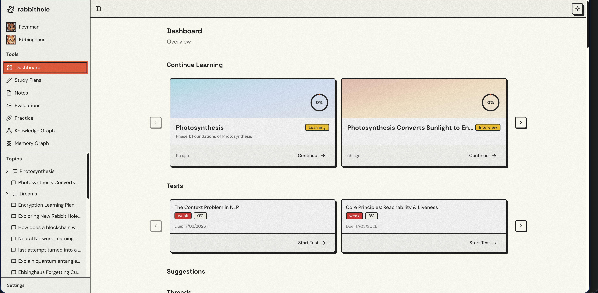

## The Problem

Every AI learning session starts from zero. You spend 45 minutes getting ChatGPT to explain number theory, close the tab, come back tomorrow, and it has no idea who you are. There's no structure, no mastery tracking, no mechanism to reinforce what you learned.

Worse — ChatGPT gives you a five-paragraph essay on a topic, and buried in paragraph three is a term you don't understand. You have two options: ignore it and keep reading (you won't retain anything), or ask about it and lose your entire conversation context. Either way, the learning session is broken.

You get the **illusion** of learning without the retention.

## Meet Your Teachers

Rabbithole is guided by two AI characters, each inspired by a foundational learning science principle:

**Mr. Feynman** — *The Teacher.* Named after Richard Feynman and the [Feynman Technique](https://en.wikipedia.org/wiki/Feynman_Technique). He believes that if you can't explain something simply, you don't understand it yet. He conducts your learning sessions, interviews you to understand your background, builds personalized study plans, and — when it's time — asks you to teach concepts back to him.

**Ms. Ebbinghaus** — *The Reminder.* Named after Hermann Ebbinghaus and the [forgetting curve](https://en.wikipedia.org/wiki/Forgetting_curve). She tracks every concept you've learned and knows exactly when you're about to forget it. She shows up with reminders, schedules reviews at scientifically optimal intervals, and makes sure nothing falls through the cracks.

Together, they form a complete learning system: **learn deeply, then retain permanently.**

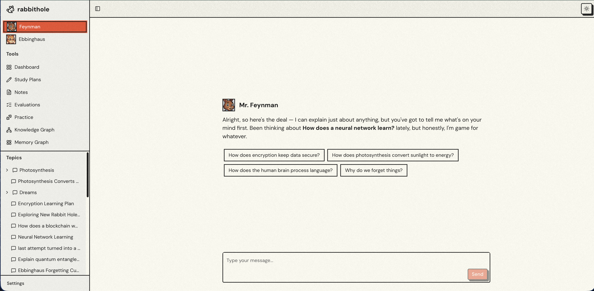

---

## Features

### Rabbit Holes — Branch Anywhere, Lose Nothing

This is the core idea. When you're learning about number theory and hit the phrase "optimization problems" — you don't have to ignore it, you don't have to abandon your current thread, and you don't have to waste context asking "wait, what's that?"

You **branch**. Right there. Mid-conversation. A new thread opens, focused entirely on optimization problems. You go deep — as deep as you want. And when you're done, you jump back to the parent thread, right where you left off. Your context is preserved. Your curiosity is rewarded.

Branches can nest. A rabbit hole inside a rabbit hole inside a rabbit hole. Each one is a focused conversation with its own memory context. The thread tree tracks exactly where you've been and where you're going.

No more wasting context. No more reading five paragraphs just to get confused by one term and giving up. No more ignoring things you don't understand.

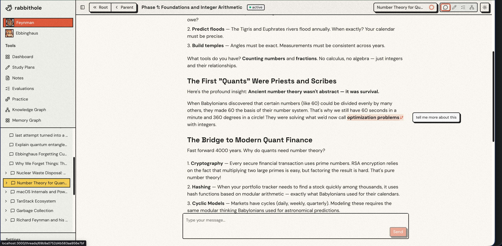

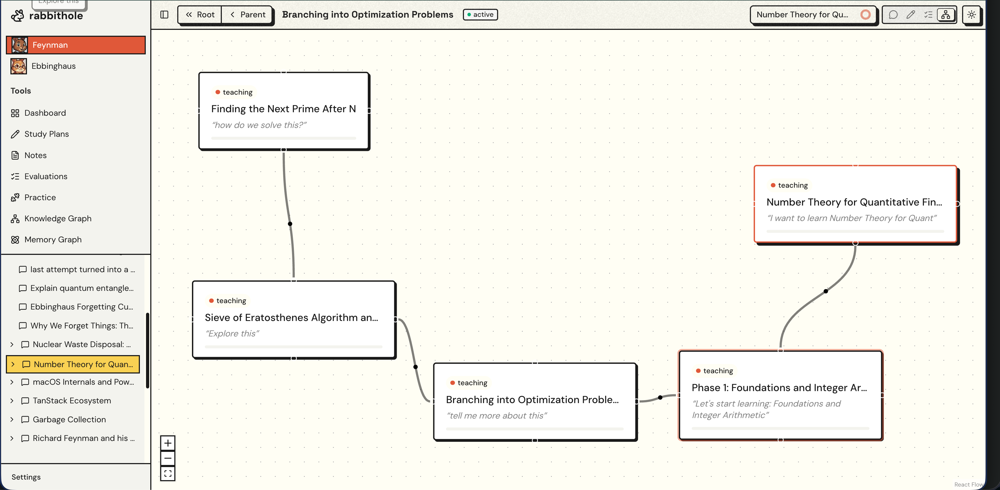

---

### Study Plans — Mr. Feynman Plans Your Journey

You don't just start chatting. Mr. Feynman conducts an interactive interview first — what do you already know? How deep do you want to go? What's your goal? Based on your answers, he generates a structured study plan: phases, concepts, dependencies, all laid out.

You review it. Adjust it. Approve it. Then he teaches you through it, one concept at a time — conversationally, not walls of text.

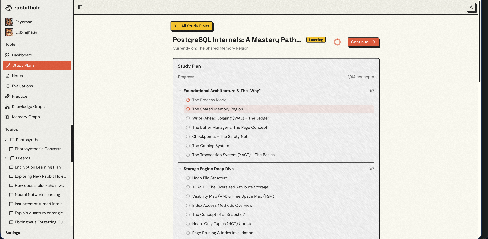

---

### Feynman Mode — Prove You Understand

After each phase of your study plan, Mr. Feynman flips the script. Instead of teaching you, he asks *you* to teach *him*. Write down what you just learned in your own words — in a rich text editor with auto-saving drafts and hints available if you're stuck.

This is the Feynman Technique in action. If you can explain it simply, you understand it. If you can't, you know exactly where your gaps are.

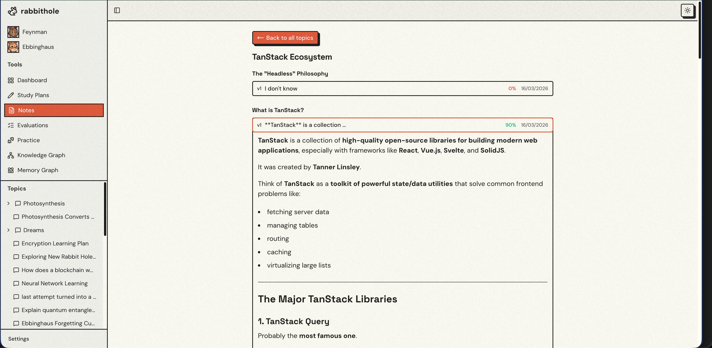

---

### Evaluations — Four-Dimensional Scoring

Your Feynman explanations aren't just read — they're scored across four dimensions:

- **Clarity** — Can you explain it simply?
- **Accuracy** — Is it factually correct?
- **Depth** — How thoroughly did you explore it?
- **Transferability** — Can you apply it to new situations?

This isn't binary pass/fail. It pinpoints *exactly* where your understanding breaks down. "Great clarity and accuracy, but your depth on edge cases is weak" is infinitely more useful than "7/10." Gaps are identified, and spaced repetition schedules are automatically created to fill them.

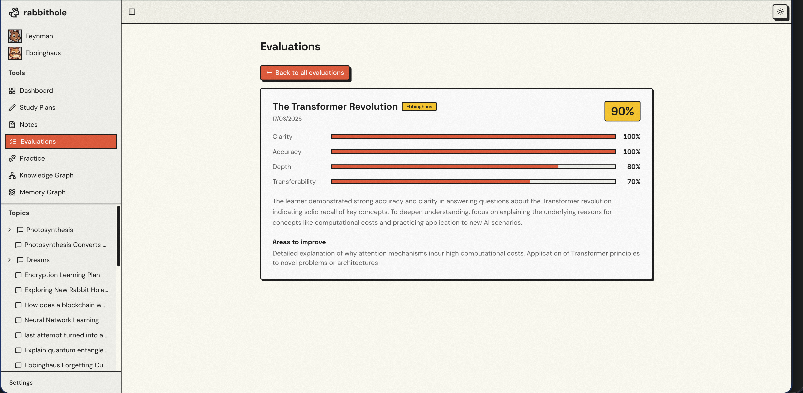

---

### Tests & Reminders — Ms. Ebbinghaus Keeps You Sharp

Ms. Ebbinghaus tracks every concept you've learned and generates targeted practice tests — multiple choice, fill-in-the-blank, and open-ended questions tailored to your mastery level.

Stopped caring about a topic? She notices. And she reminds you. Scheduled reviews appear automatically when it's time — no discipline required on your part.

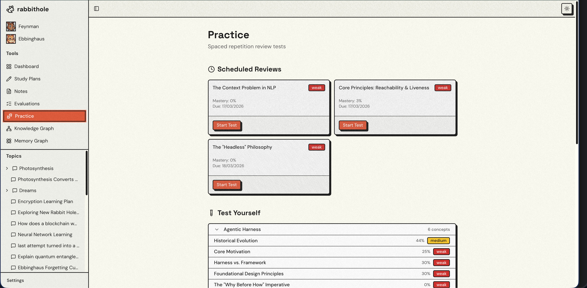

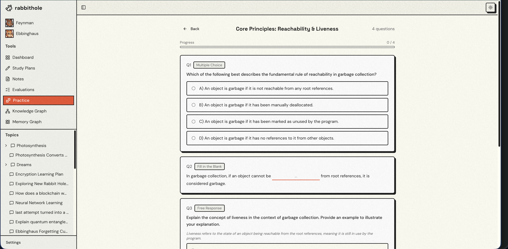

---

### Spaced Repetition — Never Forget What You Learned

Ms. Ebbinghaus calculates optimal review intervals based on your mastery scores and shows up when it's time:

| Mastery | Tier | Next Review |
|---------|------|-------------|
| 0.0 – 0.4 | Weak | 1–2 days |
| 0.4 – 0.7 | Medium | 5–7 days |
| 0.7 – 0.9 | Strong | 2–3 weeks |
| 0.9 – 1.0 | Mastered | Occasional |

She lists your topics for review with current mastery scores, weak areas, and exact review dates. No concept is left behind.

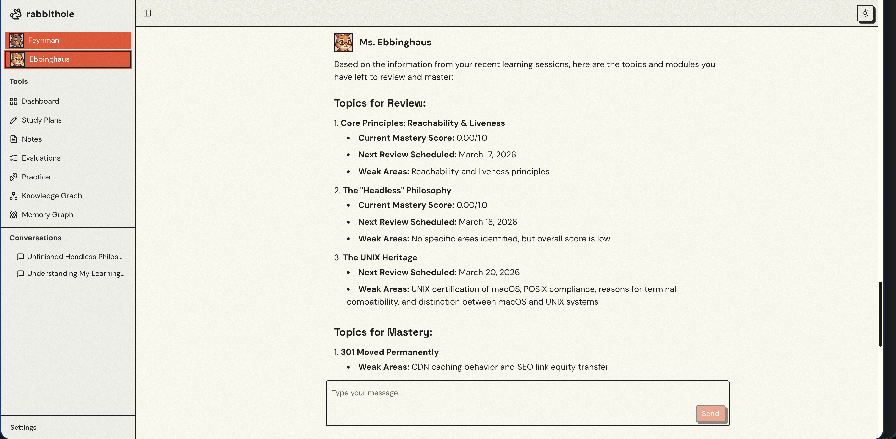

---

### Long-Term Memory — Powered by EverMemOS

Rabbithole doesn't start from zero. Ever. Built on [EverMemOS](https://evermemos.com), the system maintains a constantly evolving learner profile — your preferences, your strengths, your struggles, facts about how you learn best.

Every conversation extracts memories. Every session refines the model. Mr. Feynman remembers that you're a visual learner who struggles with abstract math but thrives with concrete examples. He adapts. Across sessions. Across weeks. Across months.

This is what makes Rabbithole fundamentally different from ChatGPT: **your knowledge compounds.**

---

### Knowledge Graph — See Your Learning Landscape

Every concept you've learned, every connection between them, every mastery score — visualized as an interactive graph. Topics are clusters. Concepts are nodes colored by mastery tier. Edges show prerequisites, relationships, and exploration paths.

Click any concept to see your mastery percentage, trend, weak areas, and the threads where you explored it.

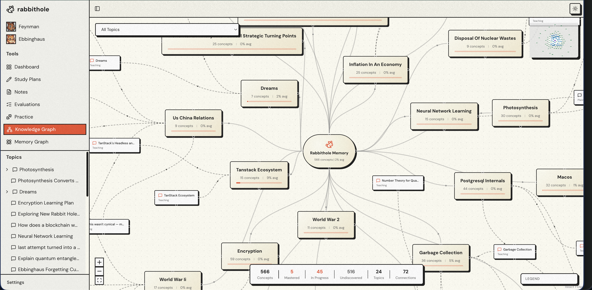

---

### Memory Graph — Visualize What the System Knows About You

A separate graph powered by EverMemOS showing the memories extracted about you as a learner — your profile, facts, learning events, and how they connect. This is the cognitive model, made visible.

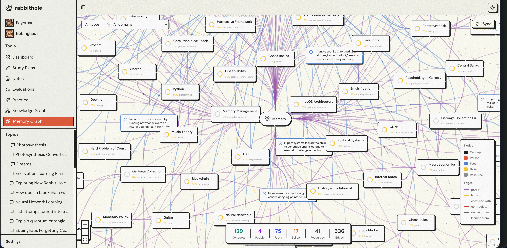

---

## How It Works

```
You say: "Teach me number theory for quant finance"

 1. Mr. Feynman interviews you — what do you know? how deep?
 2. He generates a structured study plan — phases, concepts, dependencies
 3. You approve the plan (or adjust it)
 4. He teaches you concept by concept — conversationally, not walls of text
 5. Hit a confusing term? Branch into a rabbit hole. Go deep. Come back.
 6. After each phase → Feynman Mode: explain what you learned
 7. Scored on clarity, accuracy, depth, transferability
 8. Weak concepts scheduled for spaced repetition review
 9. Next session: Ms. Ebbinghaus is waiting — "You learned X 3 days ago. Review?"
10. Your knowledge compounds. Your gaps get filled. Nothing is forgotten.
```

## Architecture

```
Next.js Frontend  ───SSE/REST───►  FastAPI Backend  ───HTTP───►  EverMemOS Cloud
   (Chat + Trees)                    (Agent Loop)                 (Long-term Memory)
                                         │
                                         ├── Mr. Feynman (teaching agent)
                                         ├── Ms. Ebbinghaus (review agent)
                                         ├── MongoDB Atlas (app data)
                                         └── OpenRouter (LLM provider)
```

The backend runs a phase-based agent loop using the **OpenAI Agents SDK**: receive message → build phase-specific agent (interview / planning / teaching) → `Runner.run_streamed()` handles the LLM + tool-calling loop → stream SSE events to the client → persist to MongoDB and EverMemOS.

## Tech Stack

| Layer | Stack |
|-------|-------|
| Frontend | Next.js 14+ (App Router), TypeScript, Tailwind CSS v4, React Flow, BlockNote |
| Backend | Python 3.12, FastAPI, OpenAI Agents SDK, Pydantic v2 |
| Database | MongoDB Atlas |
| Memory | [EverMemOS Cloud](https://evermemos.com) (api.evermind.ai) |
| LLM | OpenRouter (model-agnostic) |
| Tooling | Ruff, Basedpyright, pytest, pnpm |

## Installation

```bash
curl -fsSL https://rabbitholeai.xyz/install.sh | sh
```

This downloads the latest release, prompts for your credentials, installs dependencies, builds the frontend, and creates a `rabbithole` launcher in `~/.local/bin`. See [Prerequisites](docs/PREREQUISITES.md) for what you need before running.

## Project Status

Hackathon build (March 2026). The core learning loop is fully functional — agent phases, branching conversations, study plans, Feynman testing, spaced repetition, knowledge graphs, and persistent memory all work end to end.

---

*Go down the rabbit hole. Come back smarter.*
